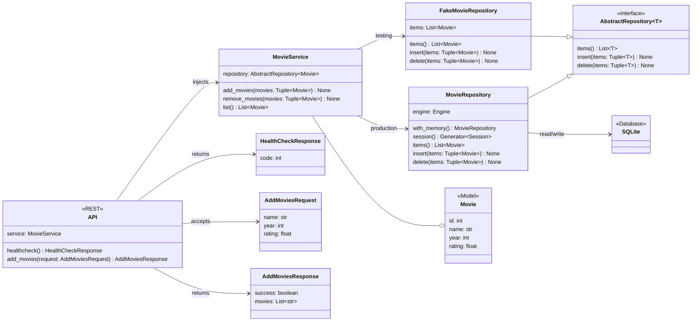

# Movies API

A simple Python backend project storing data about the movies I've watched.

The purpose is to practice and learn domain-driven design, hexagonal architecture, and test-driven development among other things fostering the technical excellence practices.

## Use Cases

The main aggregate (_Movie_) has following use cases:

- adding one or more movies
- removing one or more movies
- listing all movies

The behaviour of aggregate and its related service is described in detail under [**tests**](#tests).

## Architecture

### Class Diagram

### Frameworks

- **FastAPI** for serving the API
- **SQLite** with **SQLAlchemy** for data persistence

### Repository

Project is backed with repository pattern that connects to an SQLite database (either in-memory or in-file). Tests integrate with fake repository, which emulates the database using a standard Python list type.

## Tests

The project's tests are categorized according to the test pyramid:

- [end-to-end tests](./tests/e2e/)
- [integration tests](./tests/integration/)
- [unit tests](./tests/unit/)

## Development

All commands require the `task` runner to be installed, see [here](https://taskfile.dev). To view the complete list of available commands, run `task --list`.
